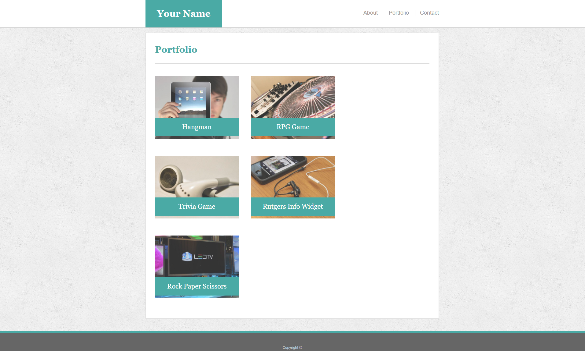

# Responsive-Bio Homework
This is responsive bio/portfolio made using bootstrap and css, it is my first attempt at building a site with Bootstrap. The general idea is that the site layout will adjust depending on the type/size of screen it is being viewed on. The baseline site should look like the following images.





## Getting Started

These instructions will get you a copy of the project up and running on your local machine for development and testing purposes. See deployment for notes on how to deploy the project on a live system.

### Prerequisites

What things you need to install the software and how to install them

```
Give examples
```

### Installing

A step by step series of examples that tell you how to get a development env running

Say what the step will be

```
Give the example
```

And repeat

```
until finished
```

End with an example of getting some data out of the system or using it for a little demo


## Built With

* [HTML](https://developer.mozilla.org/en-US/docs/Web/HTML)
* [CSS](https://developer.mozilla.org/en-US/docs/Web/CSS)
* [Javascript](https://developer.mozilla.org/en-US/docs/Web/JavaScript)

## Deployed Link

* [See Live Site](#)


## Authors

* **YOUR NAME** 

- [Link to Portfolio Site](#)
- [Link to Github](https://github.com/)
- [Link to LinkedIn](https://www.linkedin.com/)

See also the list of [contributors](https://github.com/your/project/contributors) who participated in this project.

## License

This project is licensed under the MIT License 

## Acknowledgments

* Hat tip to anyone whose code, libraries, packages, or UI was used  / inspired from
* Inspiration
* etc
